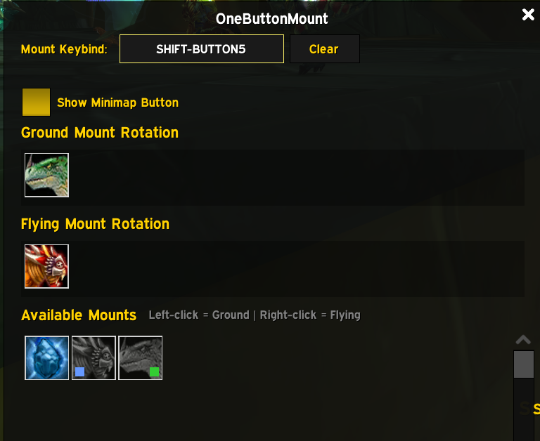

  

# OneButtonMount

- Summons a random mount from one button using your saved rotation
- Keeps separate ground and flying pools with zone-aware selection
- Supports direct keybind and mouse-chord summoning from the addon settings
- Stores mount rotations and addon settings per character

Current version: `1.0.23`

## Config UI

  

- In the available mounts list, left-click adds a mount to Ground
- In the available mounts list, right-click adds a mount to Flying
- Click any icon in the Ground or Flying rows to remove that mount
- Use `Click to Bind` to capture a keyboard or mouse button combo
- Example chord: `SHIFT-BUTTON5`

## Extras

- Applies AQ40 rules so Qiraji crystals only show up where they should
- Configurable keybinds with modifier and mouse button chords, including side buttons
- Draggable minimap button with a show/hide toggle
- Optional textual feedback toggle for addon chat output
- Per-character settings so alts keep their own rotations, keybinds, and UI preferences

## Install

1. Download the latest release from [GitHub](https://github.com/voc0der/OneButtonMount/releases/latest) or [CurseForge](https://www.curseforge.com/wow/addons/onebuttonmount).
2. Extract the `OneButtonMount` folder into:
   `World of Warcraft/_anniversary_/Interface/AddOns/`
3. Start the game and make sure the addon is enabled.

## Usage

- `/onebuttonmount` or `/obm`: Open/close config UI
- `/obm debug`: Print a one-line mount-selection diagnostic snapshot
- `/obm minimap`: Toggle minimap button
- `/obm help`: Show command help

## Contributing

Development and contribution notes are in [`CONTRIBUTING.md`](CONTRIBUTING.md).
Release workflow notes are in [`RELEASING.md`](RELEASING.md).

## Scope

- Target client: TBC Anniversary Classic
- TOC interface: `20504`

## Star History

  <a href="https://star-history.com/#voc0der/OneButtonMount&Date">
    <picture>
      <source media="(prefers-color-scheme: dark)" srcset="https://api.star-history.com/svg?repos=voc0der/OneButtonMount&type=Date&theme=dark" />
      <source media="(prefers-color-scheme: light)" srcset="https://api.star-history.com/svg?repos=voc0der/OneButtonMount&type=Date" />
      
    </picture>
  </a>

